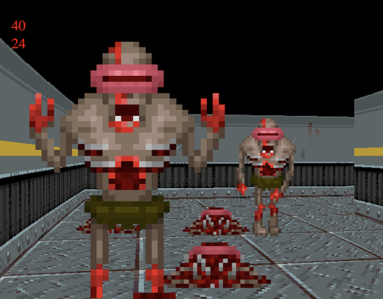

Browser First Person Shooter
============================

This is a [wolfenstein](https://en.wikipedia.org/wiki/Wolfenstein)-like single player game. It uses old approaches from the 1990s, raycasting algorithm. All the graphics calculations take place on the CPU, so the game has performance limitations, but it's enough for playing.

## Assets
- Textures, https://little-martian.itch.io/retro-texture-pack
- Characters, https://fredrichi.itch.io/free-characters-with-animations-for-fps-game
